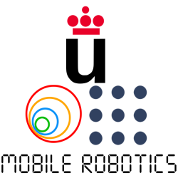

# 🤖 Mobile Robotics Blog

  

___

Hi there! I am [Diego García](https://github.com/dgarcu), a student from [Robotics Software Engineer from URJC](https://www.urjc.es/universidad/calidad/3099-ingenieria-de-robotica-software).

In this blog you will find all progress regarding the exercises from **Mobile Robotics** subject from said grade. From the statement to the final solution, passing through the entire development process that includes **both** good ideas and frustrated ideas.

Hope you find it interesting and helpful!
